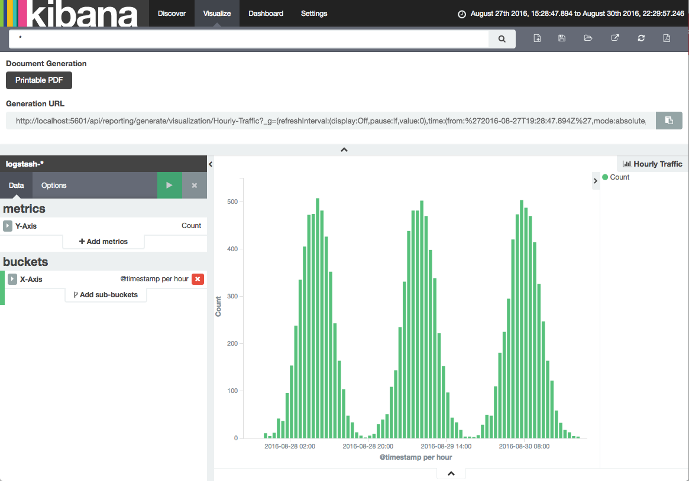

+++
title = "Logging with the Elastic Stack"
description = "The Elastic stack, also known as the ELK stack, has become a wide-spread tool for aggregating logs. This recipe helps you to set it up in Kubernetes."
date = "2016-10-24"
type = "page"
weight = 50
categories = ["recipes"]
+++

# Logging with the Elastic Stack

The Elastic stack, most prominently know as the ELK stack, in this recipe is the combination of Filebeat, Elasticsearch, and Kibana. This stack helps you get all logs from your containers into a single searchable data store without having to worry about logs disappearing together with the containers. With Kibana you get a nice analytics and visualization platform on top.



## Deploying Elasticsearch, Filebeat, and Kibana

First we create a namespace and deploy our manifests to it.

```bash
kubectl create namespace logging
kubectl --namespace logging create \
  --filename https://raw.githubusercontent.com/giantswarm/kubernetes-elastic-stack/master/manifests-all.yaml
```

## Configuring Kibana

Now we need to open up Kibana and set `filebeat-*` for `index pattern`.

Then, we can choose `json.time` for `time-field name` below.

All set! You can now use Kibana to access your logs including filtering logs based on pod names and namespaces.
